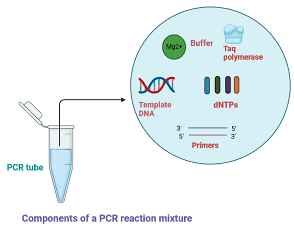
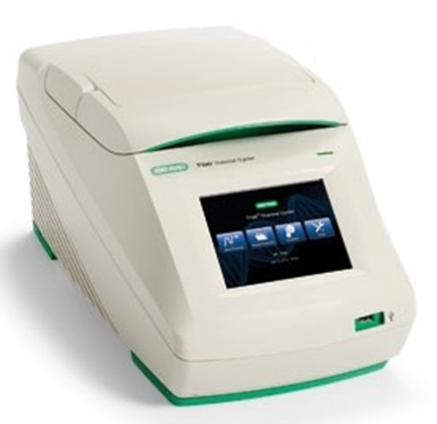

## Procedure

Steps | Action  | Procedure Details| 
:--|:--|:--|
 | Thawing the PCR reaction components on ice |  All the components of the PCR reaction must be thawed and centrifuged before use  |
 | Preparation of the PCR reaction mix |  The components required for PCR as mentioned before are assembled in a tube and mixed and centrifuged. Bubbles must be avoided in the PCR reaction tube. In order to avoid  non-specific primed synthesis during the assembly of the reaction prior to PCR cycling, all components of the PCR reaction must be assembled on ice and the DNA- Polymerase should be added at last.  |
 | Incubation of the PCR reaction mixture in a thermal cycler |  PCR cycling and running parameters must be set up for efficient amplification. The details steps are described below.|

#### The basic steps of the PCR cycling reactions are:
1. **Denaturation (94-96°C):** The denaturation step is carried out at the beginning of PCR and use high temperature to  separate the double-stranded template DNA into single strands by breaking the hydrogen bond between bases on complementary strands. The initial denaturation step is usually performed at 94–98°C for 1–3 minutes. The time and temperature of this step can differ depending on the nature of the template DNA and salt concentrations of buffer. 
2. **Annealing (55- 65°C):** In this step, the PCR  reaction temperature is lowered to allow binding of the primers to the target DNA sequence of the template. Incubation time of 0.5–2 minutes is sufficient for primer annealing. The annealing temperature is determined by calculating the melting temperature (Tm) of the selected primers for PCR amplification.
3. **Extension (72°C):** The purpose of the next step in PCR is to extend the 3′ end of primers, complementary to the template. In this step, 5′→ 3′ polymerase activity of the DNA polymerase  results in the incorporation of dNTPs and synthesis of the daughter strands. The reaction temperature is raised to the optimum temperature of the DNA polymerase enzyme for its maximal activity, which is generally 70–75°C for thermostable DNA polymerases. The extension time in PCR depends upon a certain factor such as the synthesis rate(processivity) of the DNA polymerase used and the length of target DNA that we want to amplify. The extension time for Taq DNA Polymerase is 1 min/kb, whereas that of Pfu DNA polymerase is 2 min/kb. Therefore, certain enzymes with low processivity and longer DNA amplicons will require more time for extension in order for amplification to take place.

#### PCR cycle number determination
PCR steps of denaturation, annealing, and extension are repeated many times to amplify the target DNA from the target strand. The number of cycles is usually carried out 25–35 times but it may differ depending upon the amount of DNA input and the desired yield of PCR product.  
If we are assuming that the efficiency of the PCR reaction is perfect, then there will be doubling of the template DNA at each cycle.  
The final number of target DNA molecules is Y = X(2n) 
where “X” is the number of  target DNA  at cycle one, “n” is the number of cycles, and “Y” is the final number of target molecules.

Schematic representation of the PCR amplification reaction.

