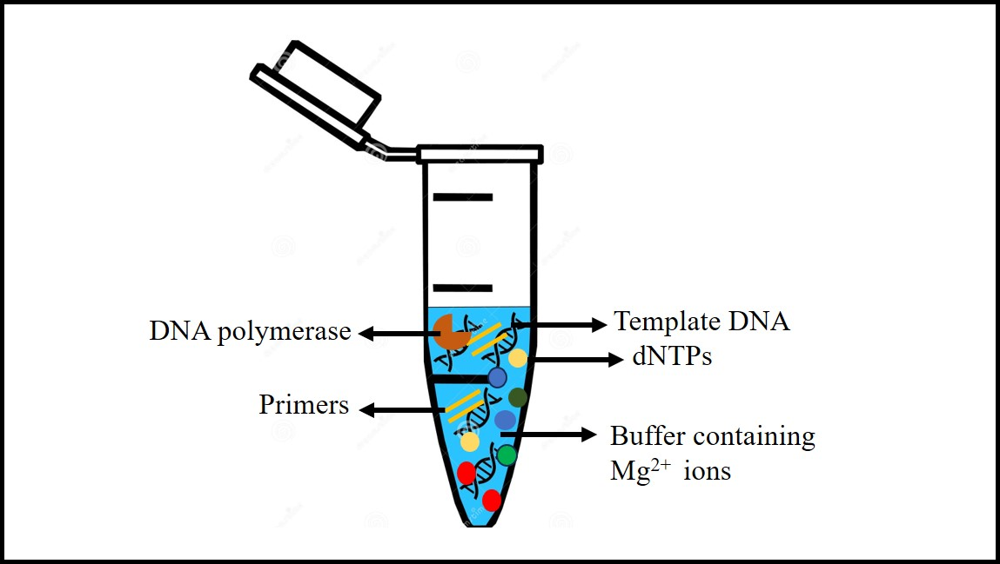

## Objective

PCR is a technique utilized to make multiple copies of a specific DNA sequence in vitro. The  PCR reaction is repeatedly cycled through a series of temperature changes, which allow many copies of the target DNA sequence to be produced. PCR has many research and practical applications. It is routinely used for DNA cloning, mutagenesis, medical diagnostics, agricultural testing, and forensic analysis of DNA.

## Theory

The basic principle of PCR relies on amplifying a specific DNA sequence into millions of copies in a short time. Reaction components of the PCR that play critical roles in amplification are described below

1.	**Template DNA :** Template DNA  contains the DNA target region for amplification. A PCR template can be from any DNA source, such as genomic DNA (gDNA), complementary DNA (cDNA), or plasmid DNA. 0.1–1 ng of plasmid DNA and 5–50 ng of genomic DNA may be required as a starting amount in a 50 µL PCR. Optimization of the amount of template DNA required is necessary because higher DNA concentration increase the possibility of non-specific amplification whereas low amount of DNA leads to reduced yield.
2.	**DNA polymerase :** DNA polymerase play critical role in replication of the target DNA. In a typical 50 µL reaction, 1–2 units of DNA polymerase are sufficient for amplification of target DNA. The four properties of DNA polymerase that make these enzymes versatile are specificity, thermostability, fidelity, and processivity. Specificity ensures that the target DNA is amplified sufficiently by reducing the amount of non-specific amplification. Strong processivity and thermostability  helps in in amplification of secondary structures, GC-rich sequences, and long DNA. Finally, high fidelity provides accuracy and precision in sequence replication. Taq DNA polymerase, derived from the thermophilic bacteria Thermus aquaticus and  Pfu DNA polymerase from the archaeal hyperthermophile Pyrococcus furiosus are examples of some commonly  used DNA polymerase.
3.	**Primers :**  Primers are synthesized DNA oligonucleotides of approximately 15–30 bases with 40-60% GC content. PCR primers are designed to bind via sequence complementarity to sequences that flank the region of interest in the template DNA. During PCR, DNA polymerase extends the primers from their 3′ ends. The primers’ binding sites must be unique to the vicinity of the target with minimal homology to other sequences of the input DNA in order to ensure specific and maximum amplification of the  target DNA. In setting up PCR, primers are added to the reaction in the range of 0.1–1 μM.
4.	**dNTPs :** dNTPs consist of four basic nucleotides—dATP, dCTP, dGTP, and dTTP that act as the building blocks of new DNA strands using DNA polymerase. These four nucleotides are  added to the PCR reaction in equimolar amounts ,  200 μM of each for optimal base incorporation.
5.	**Mg2+ ions:** Magnesium ion (Mg2+) acts as a cofactor for activity of DNA polymerases by enabling incorporation of dNTPs during polymerization. Optimal Mg2+ concentration is usually 1.5–2.0 mM for most PCR polymerases.

6.	**Buffer:** PCR is carried out in a buffer that provides a suitable chemical environment for activity and stability of DNA polymerase. The buffer pH is usually between 8.0 and 9.5.The salt composition of the buffer differs for different kind of DNA polymerases.

The components required for PCR are assembled in a tube, along with cofactors needed by the enzyme as shown in the figure above, and are put through repeated cycles of heating and cooling in a thermal cycler that allow DNA to be synthesized.

PCR amplification takes place in a thermal cycler as shown on the left, which is an instrument that automates temperature cycling and incubation times for PCR.

Schematic representation of the PCR processes that take place inside a thermal cycler.

